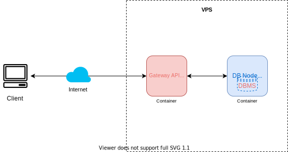

# User CRUD API
  Simple CRUD API with Express JS and Mongodb

  ## Run migrations
  ---
  
    npm run migrate

  ## Run server
  ---
    npm run start

  ## Default User
  ---
  - **Admin**
    - username: `admin`
    - password: `admin123`
  
  - **User**
    - username: `user`
    - password: `user123`

  ## Example server
  ---
  API Endpoint Root
  ---
     http://user-crud-api.mustosoft.my.id:3000/api

  ## Postman Collection
  ---
  Download postman collection [here](./postman/User CRUD API.postman_collection.json)

  ## Architecture Diagram
  
  